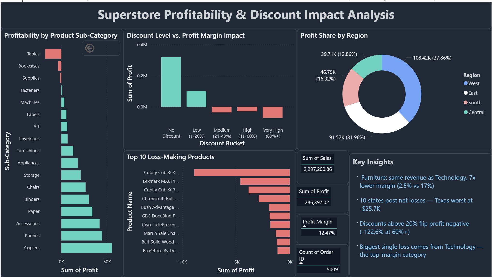

# Superstore-Profitability-Discount-Impact-Analysis
An end-to-end data analytics project uncovering profitability drivers and discount-related losses in retail transaction data from a US-based superstore, using Excel, SQL, and Power BI.

## 📌 Project Overview

This project moves beyond sales volume to analyze profitability — identifying which product categories, regions, and discount levels are actually profitable versus loss-making. The goal was to practice a full analyst workflow — from raw data cleaning to PivotTable exploration, SQL verification, and a decision-ready Power BI dashboard — while uncovering insights a surface-level sales report would miss.

Dataset: [Superstore Dataset – Final](https://www.kaggle.com/datasets/vivek468/superstore-dataset-final) (public dataset, Kaggle), containing 9,994 transactions with fields including Sales, Profit, Discount, Category, Sub-Category, Region, State, Segment, and Ship Mode.

## ❓ Business Questions

- Which product categories and sub-categories are the most profitable, and which are consistently losing money?
- Which regions and states generate the highest profit, and which are dragging overall profitability down?
- Is there a relationship between discount percentage and profit — is there a tipping point where discounts start causing losses?
- Which customer segments are most and least profitable?
- Does Ship Mode have any noticeable effect on profit margins?
- What are the top loss-making products, and what do they have in common (category, discount level, region)?

 ## 📊 Excel Analysis

The raw dataset (9,994 transactions) was imported into Excel and converted into a structured Table. Data quality checks confirmed there were no duplicate rows and no missing values across key fields (Sales, Profit, Discount, Category, Region). The Discount field was confirmed to be stored in decimal format (e.g., 0.2 = 20%).

Two calculated columns were added: Profit Margin (Profit ÷ Sales, to measure efficiency rather than raw profit) and Discount Bucket (grouping transactions into No Discount, Low 1–20%, Medium 21–40%, High 41–60%, and Very High 60%+, using nested IF logic).

Three PivotTables and charts were built to answer the core business questions:

1. Profitability by Category and Sub-Category At the category level, all three categories appear profitable — but margins tell a different story: Technology (17.4%) and Office Supplies (17.0%) are efficient, while Furniture lags far behind at just 2.5%, despite generating nearly as much revenue as Technology ($742K vs $836K). Drilling into sub-categories revealed why: Tables (-$17,725) and Bookcases (-$3,473) are outright loss-making, with their losses masked at the category level by strong performers like Chairs (+$26,590) and Furnishings (+$13,059). Supplies, within Office Supplies, is also loss-making (-$1,189).

2. Profitability by Region and State No region shows an overall loss, but efficiency varies widely — West leads with a 14.9% margin, while Central trails at just 7.9%. State-level analysis exposed the cause: 10 states are net loss-makers, led by Texas (-$25,729), followed by Ohio (-$16,971), Pennsylvania (-$15,560), and Illinois (-$12,608). Central region's weak margin is driven almost entirely by losses in Texas and Illinois, while even the top-performing West region has loss-making states (Colorado, Arizona, Oregon) offset by strong results in California and Washington.

3. Discount Impact on Profitability This was the most decisive finding of the analysis. Grouping all 9,994 transactions into discount bands revealed a clear tipping point around the 20% discount mark:

| Discount Level | Orders | Profit Margin |
|---|---|---|
| No Discount | 4,798 | 29.5% |
| Low (1–20%) | 3,803 | 11.9% |
| Medium (21–40%) | 460 | -15.3% |
| High (41–60%) | 215 | -40.7% |
| Very High (60%+) | 718 | -122.6% |

Profitability is positive at 20% discount or below, and turns sharply negative beyond that threshold — reaching a margin of -122.6% at discounts above 60%, meaning the business loses more than a dollar for every dollar of sales in that band. This pattern held across a substantial sample (1,393 orders, ~14% of all transactions), not just a handful of outliers.

4. Top Loss-Making Products Ranking all products by total profit surfaced a mix that category-level analysis alone would not predict: the single biggest loss-maker is a Technology product — the Cubify CubeX 3D Printer (Double Head, -$8,880) — despite Technology being the highest-margin category overall (17.4%). Of the top 10 loss-making products, 5 are Furniture items (mostly tables and conference furniture, reinforcing the earlier sub-category finding), 3 are high-value Technology products (3D printers, a laser printer, a videoconferencing unit), and 2 are Office Supplies. This shows that category-wide profitability can mask a small number of specific, high-cost, low-margin products driving outsized losses.

📂 [View Excel Analysis](Excel%20Analysis/superstore_profitability_analysis.xlsx)

## 🗄️ SQL Analysis

All 9,994 records were loaded into a MySQL database (superstore.orders) to independently verify the Excel findings using GROUP BY, CASE WHEN, and aggregate queries, and to answer two additional business questions not covered in Excel.

Cross-validation: Category, sub-category, region, state, and discount-bucket profitability figures were recalculated in SQL and matched the Excel results exactly — confirming the findings are consistent and not the result of a spreadsheet error. The discount tipping point in particular was reproduced precisely (e.g., -122.63% margin at 60%+ discount), reinforcing that this is a stable, real pattern in the data.

1. Customer Segment Profitability Segment-level analysis (not covered in Excel) revealed a counterintuitive pattern: Consumer, the largest segment by both order count (5,191 orders, ~52% of all orders) and revenue ($1.16M), has the lowest profit margin at 11.55%. Home Office, the smallest segment (1,783 orders), is the most efficient at 14.03%, with Corporate in between (13.03%). This suggests the business's highest-volume customer segment is also its least profitable on a per-dollar basis.
 
2. Ship Mode Profitability All four shipping modes are profitable, with a relatively narrow margin range (12.08%–13.93%) compared to other dimensions analyzed. First Class has the best margin (13.93%) and Standard Class — the most-used mode by far (5,968 orders, ~60% of all orders) — has the lowest (12.08%). The difference is modest and not a strong driver of overall profitability on its own.

3. Top Loss-Making Products (verified) Re-running the loss-making product ranking in SQL, with order frequency added, sharpened the earlier Excel finding: the single biggest loss-maker, the Cubify CubeX 3D Printer (Double Head), was ordered only 3 times yet lost a combined -$8,880 — an average loss of nearly $2,960 per order. This points to a severe per-unit pricing or discounting issue on this specific product, rather than a high-volume, small-margin problem.

📂 [View SQL Analysis](SQL%20Analysis/Superstore%20Profitability%20SQL%20Analysis.sql)

## 📊 Power BI Dashboard

A single-page interactive dashboard was built to consolidate the Excel and SQL findings into a decision-ready visual format, combining four KPI summary cards, four core visuals, and a narrative insights panel.

**KPI Summary Cards:** Total Sales ($2.29M), Total Profit ($286K), overall Profit Margin (12.47%), and Order Count (5,009) give an at-a-glance view of business scale and health before drilling into detail.

**Profitability by Product Sub-Category:** A horizontal bar chart ranks all 17 sub-categories by profit, immediately isolating the three loss-makers (Tables, Bookcases, Supplies) that are otherwise hidden within profitable parent categories — visually reinforcing the Excel finding that category-level numbers can mask sub-category losses.

**Discount Level vs. Profit Margin Impact:** A column chart across the five discount bands (No Discount → Very High 60%+) makes the profitability tipping point immediately visible — profit stays strongly positive through the "Low" discount band and turns sharply negative from "Medium" onward, visually confirming the -122.6% margin finding at the highest discount tier.

**Profit Share by Region:** A donut chart breaks down the $286K total profit across West (37.9%), East (32.0%), South (16.3%), and Central (13.9%) — showing that while all regions are profitable overall, West alone generates over a third of total profit, consistent with the state-level analysis in SQL.

**Top 10 Loss-Making Products:** A ranked bar chart of the ten biggest individual loss-makers surfaces the Cubify CubeX 3D Printer as the single largest loss, alongside a mix of Furniture and Technology products — reinforcing that a handful of specific SKUs, not entire categories, are driving the worst losses.

**Key Insights Panel:** A dedicated summary panel distills the four most decisive findings from the full analysis — Furniture's margin gap, the 10 loss-making states, the 20% discount tipping point, and the Technology-category loss anomaly — into a scannable, narrative format that summarizes the core story without requiring a full read of the report.

📁 [Download the Power BI file](Dashboard/superstore_dashboard.pbix)

## Key Takeaways

* Profitability, not sales volume, tells the real story. Furniture generates revenue nearly on par with Technology ($742K vs $836K) but returns 7x less profit margin (2.5% vs 17.4%) — category-level revenue figures alone would have missed this.
* Losses hide inside profitable categories. Tables and Bookcases are outright loss-making sub-categories, but their losses are masked at the category level by strong performers like Chairs and Furnishings.
* Discounting has a clear tipping point. Profit stays positive at discounts of 20% or below, then turns sharply negative beyond that — reaching a -122.6% margin at discounts above 60%, confirmed independently in both Excel and SQL.
* High volume doesn't mean high efficiency. The Consumer segment generates the most orders and revenue but has the lowest profit margin (11.55%) of the three customer segments — Home Office, the smallest segment, is the most efficient (14.03%).
* A handful of products drive outsized losses. The single biggest loss-maker — a Technology product ordered only 3 times — lost nearly $2,960 per order, despite Technology being the highest-margin category overall.

